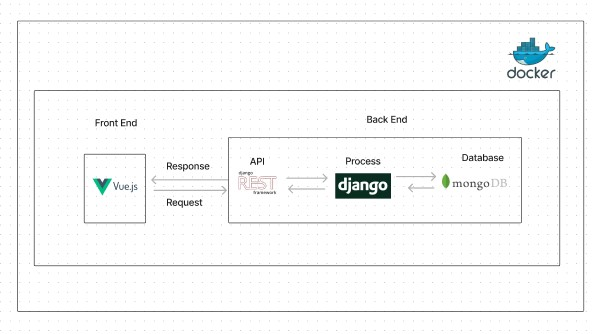

# docker

docker - vue.js - mongodb - django

## Project setup

delete data or log files from a database in folder data-db

```
docker-compose build
docker-compose up -d
```

Ref

- [How to Create a Django Docker Application Container](https://duckduckgo.com).

- [Using MongoDB with Docker](https://earthly.dev/blog/mongodb-docker/).

- [Docker VueJS Example](https://www.middlewareinventory.com/blog/docker-vuejs/).

- [Django-MongoDb-CRUD-RESTAPI](https://github.com/rishi772001/Django-MongoDb-CRUD-RESTAPI/blob/main/django_mongodb/settings.py).

- [How to enable CORS headers in your Django Project](https://www.geeksforgeeks.org/how-to-enable-cors-headers-in-your-django-project/)

## Our plan:


